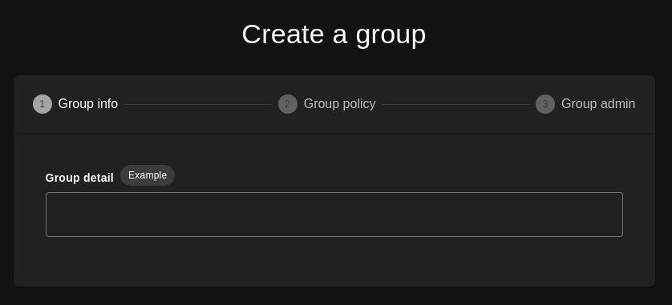
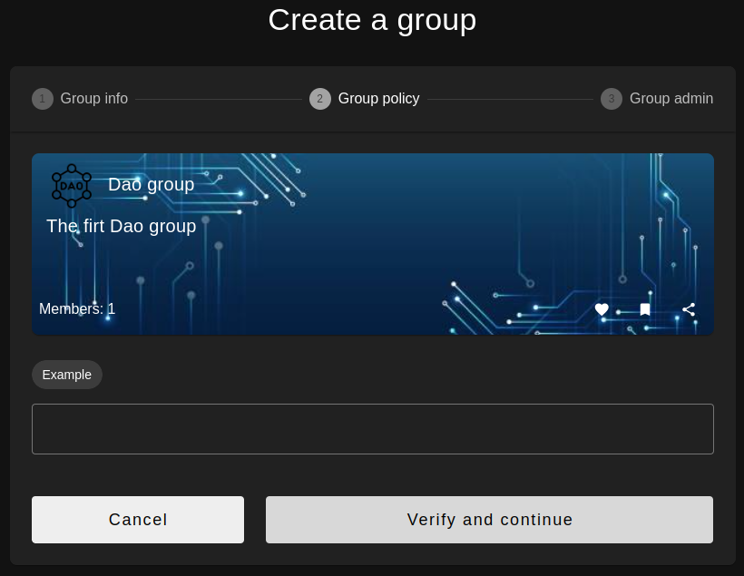
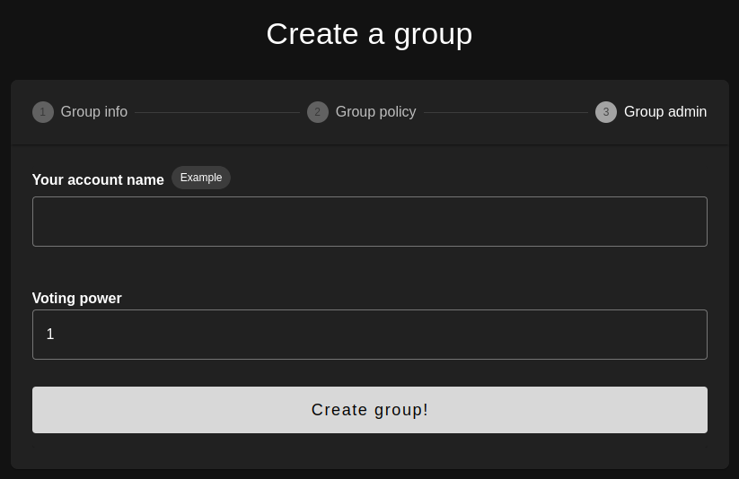

# Create group
A new group can be created with the MsgCreateGroup, which has an admin address, a list of members and some optional metadata.

To create your group, you will need 3 metadata files:

- ```group.json``` 
- ```policy.json```
- ```user.json```
 

## Step 1


Use ```group.json``` in group detail field, if your json is well formed and contains all the data, you will see the preview of your group

## Step 2


Same principle as step 1, this time, add the metadata of your policy (```policy.json```)  
If your json is well formed and contains all the data, you will see the preview of your policy

## Step 3
 

Use ```user.json``` in group detail field, if your json is well formed and contains all the data, you will see the preview of your user

 